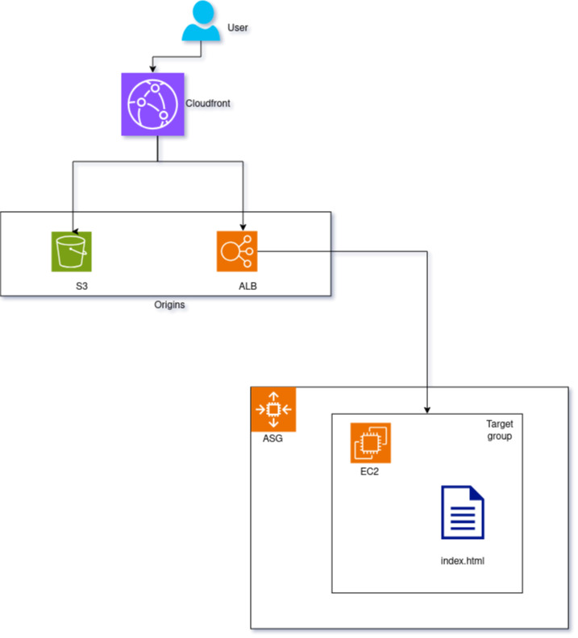

# Check out "Host a static website using AWS CloudFront with S3 & ALB as origins" on Medium

<div style="text-align:center">
  
</div>

---
> *Caution:* Cost will be involved in creating these resources. For more information, do visit the relavent resource pricing pages as it differs from region to region.
- https://aws.amazon.com/elasticloadbalancing/pricing/
- https://aws.amazon.com/ec2/pricing/
---

## To provision the resources in this repository:
1. Clone this repo
2. If you have an ACM certificate in the us-east-1 region and a public Route53 hosted zone. You can modify the default value of the 3 variables below in [./variables.tf](variables.tf)
  > - acm_certificate_arn
  > - hosted_zone_name
  > - hosted_zone_id
3. `terraform init`
4. `terraform plan` <br>
If you left the "acm_certificate_arn" variable empty, there should be 27 resources to be created. Else, 28 resources to be created.
5. `terraform apply` <br>
As no backend is defined, the default backend will be local. Do wait for 10-15 minutes for the resources to be provisioned.

## Clean-up
1. `terraform destroy`
2. If you enabled logging you will want to empty the bucket before destroying the infrastructure. On terminal it is:
```bash
bucket_name="cloudfront-logs-maec54"

aws s3api delete-objects \
  --bucket ${bucket_name} \
  --delete "$(aws s3api list-object-versions \
  --bucket "${bucket_name}" \
  --output=json \
  --query='{Objects: Versions[].{Key:Key,VersionId:VersionId}}')"
```